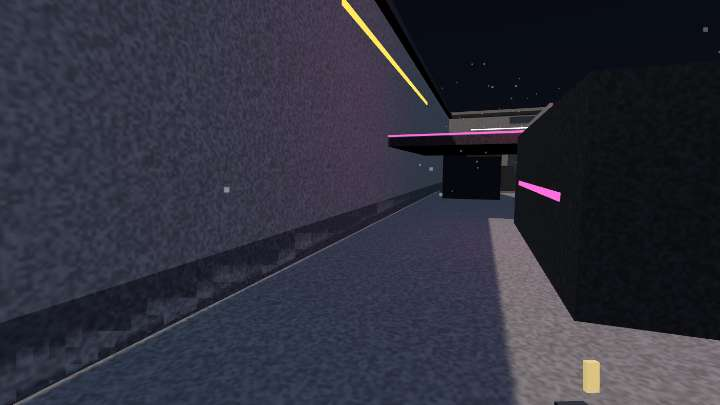

# SHOTDIS

A fast, lightweight competitive browser FPS. No download, no accounts: open the page, pick a rifle, and you are in a five-minute deathmatch within seconds.

- **Play:** https://shotdis.vercel.app
- **Source:** https://github.com/dimssu/shotdis



## Gameplay

- Free-for-all deathmatch, 5-minute rounds, instant respawn (3 s), rotating arenas.
- Four primaries (VK-7 rifle, Hornet SMG, Breaker 12 shotgun, Longshot MK2 sniper) plus the P9 sidearm.
- Hitscan weapons with spread, bloom, recoil, damage fall-off and 1.4–2.0× headshots.
- 100 health + 50 armor on spawn; armor soaks 60 % of incoming damage while it lasts.
- Score: 100 per kill, +25 headshot, streak bonuses at 3 / 5 / 7 / 10.
- Bots fill empty slots so a room is never empty; **Practice** runs the whole match offline.
- Two arenas: **Warehouse** (compact industrial, catwalks, crates) and **Neon District** (rain-slick streets, alleys, rooftops).

## Controls

| Action | Keys |
| --- | --- |
| Move | W A S D |
| Jump / Sprint / Crouch | Space / Shift / Ctrl or C |
| Fire / Aim | Left mouse / Right mouse |
| Reload | R |
| Weapons | 1, 2, Q, mouse wheel |
| Scoreboard | Tab (hold) |
| Pause | Esc |

## Architecture

```
src/
  shared/    Everything both sides run: config, weapons, physics, maps, protocol,
             and sim/room.ts — the authoritative game room.
  server/    Node WebSocket server: room manager, origin checks, rate limiting.
  client/    three.js engine (game/), React UI (ui/), zustand store (app/).
```

**One simulation, two hosts.** `GameRoom` owns players, inputs, hitscan, damage, scoring and the match state machine. It has no dependency on Node or the DOM, so:

- the **server** runs it per room and is authoritative for everything competitive;
- the **browser** runs the very same class through a loopback transport for offline practice.

**Movement** is a deterministic fixed-step (60 Hz) simulation shared by client and server. The client predicts every input immediately, the server replays the same inputs, and on each snapshot the client restores the authoritative state and re-applies unacknowledged inputs (reconciliation with a short visual smoothing so corrections are invisible).

**Netcode**

- Inputs: batched every 3 sim steps (`[seq, dt, keys, yaw, pitch]`).
- Snapshots: 20 Hz, remote players rendered 100 ms behind with interpolation (and ≤120 ms extrapolation).
- Hit registration: server-side hitscan with lag compensation — every shot is evaluated against where targets were at the shooter's render time (up to 250 ms rewind).
- Clock sync from ping/pong samples (median of the lowest-RTT samples).
- Weapon timing runs on a per-player simulation clock advanced by input dt, so client and server reach identical reload/fire-rate results.

**Anti-cheat basics** (all server-side): input dt bounds, a real-time budget so clients cannot simulate faster than wall-clock, fire rate / ammo / reload enforced by the shared weapon state machine, damage only from server raycasts, message validation and rate limiting, nickname sanitisation, origin allow-list.

**Rendering:** each arena is authored as boxes and ramps and merged into one mesh per material (≈20 draw calls per map). Procedural noise textures, a gradient sky dome, GPU point sparks, pooled tracers/casings, one shadow-casting sun. Quality presets scale shadows, antialiasing, particles and resolution.

**Audio:** every sound and both music tracks are synthesised with the Web Audio API at startup (gunshots, reloads, footsteps, UI, countdown, kill/headshot/streak, ambience). Spatialised for remote shots and steps.

## Deployment

```
Browser ──HTTPS──▶ Vercel (static Vite build)
        ──WSS───▶ Google Cloud Run (Node + ws, single instance, scale-to-zero)
```

- Frontend: Vercel, project `shotdis`, builds with `pnpm build:client`.
- Game server: Cloud Run service `shotdis-server` in `asia-south1`, built from the `Dockerfile` (`scripts/deploy-server.sh`). Runs one instance at most so every player lands in the same process; scales to zero when idle (first connection after idle takes ~2 s).
- Vercel serverless functions cannot host persistent WebSockets, which is why the server lives elsewhere. Any Node host works (Fly, Railway, Render, a VPS): `pnpm build:server && pnpm start`.

## Environment variables

See `.env.example`.

| Variable | Where | Meaning |
| --- | --- | --- |
| `VITE_SERVER_URL` | client build | WebSocket URL of the game server. Empty = practice-only build. |
| `PORT` | server | Listen port (Cloud Run injects it). |
| `ALLOWED_ORIGINS` | server | Comma-separated browser origins allowed to connect; `*` wildcards supported. Empty = any (dev). |
| `ROOM_SIZE` / `BOT_FILL` | server | Players per room / bots that fill empty slots. |

## Local development

```bash
pnpm install
pnpm dev          # client on http://localhost:5180 + server on ws://localhost:8787
```

Other commands: `pnpm test`, `pnpm typecheck`, `pnpm lint`, `pnpm build`, `pnpm check` (all of the above), `pnpm docker:build`.

During development `?debug=1` skips pointer lock and exposes `window.__game` / `window.__store`; `?map=neon` picks the practice map.

## Performance notes

- Target: 60 FPS on ordinary laptops. Measured 120 FPS (display-capped) on an M3 laptop at High.
- JS bundle ≈ 220 KB gzipped (three.js is the bulk); no textures, models or audio files are downloaded.
- Per-frame allocations are avoided in the hot path; HUD state is pushed to React at 15 Hz.
- Network: ~20 input messages/s upstream, 20 snapshots/s downstream (≈ 2–4 KB/s per player at 8 players).

## Roadmap

- Ranked / private rooms and parties (the room manager is already the seam).
- Team modes, more arenas, weapon skins.
- Killcam and spectator camera while dead.
- Optional touch controls.
